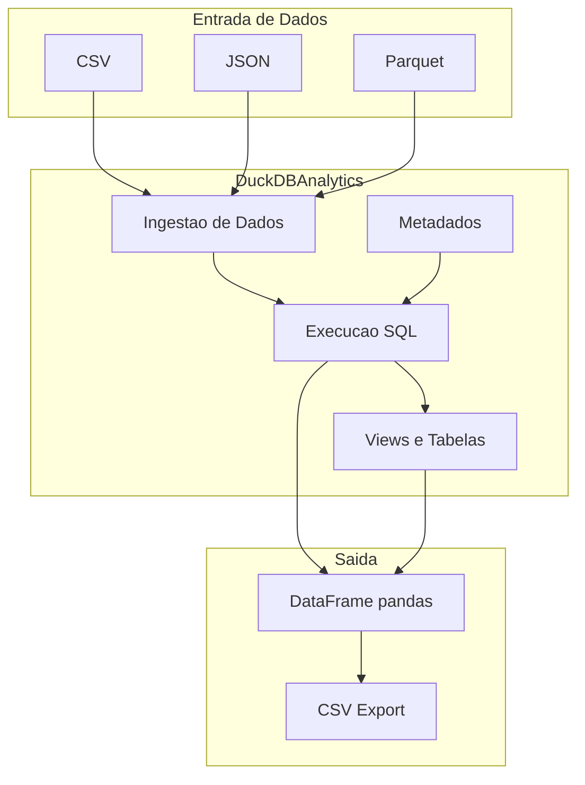
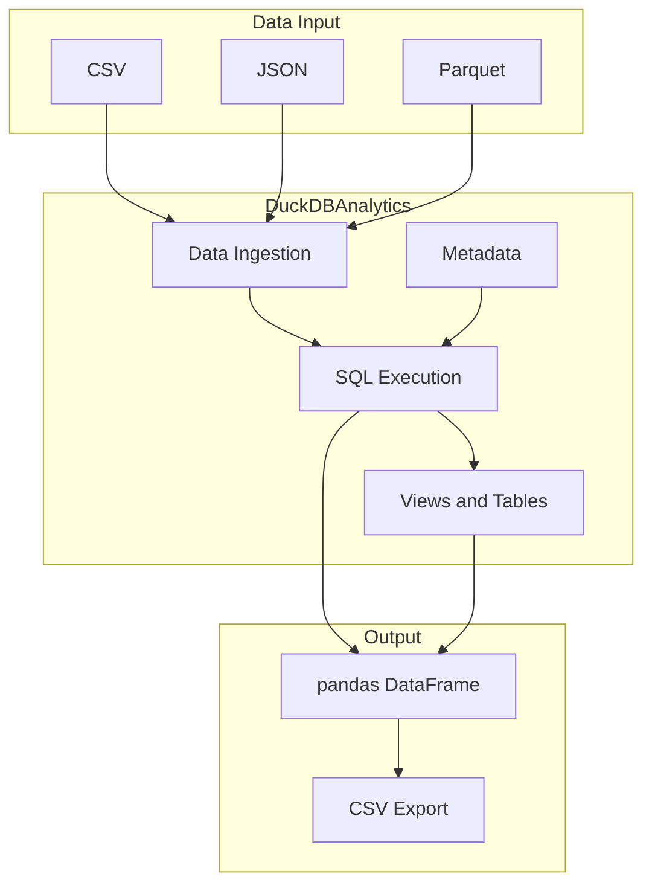

# DuckDB Embedded Analytics Engine

Wrapper Python para DuckDB com ingestao de dados, execucao SQL e exportacao CSV.

[](https://python.org)
[](https://duckdb.org)
[](LICENSE)

[English](#english) | [Portugues](#portugues)

---

## Portugues

### Visao Geral

Wrapper em Python sobre o DuckDB para simplificar ingestao de dados (CSV, JSON, Parquet), execucao de queries SQL, criacao de views/tabelas, e exportacao de resultados para CSV. Inclui um gerador de dados sinteticos com Faker para demonstracao.

### Arquitetura



### Funcionalidades

- **Ingestao de dados** — CSV, JSON e Parquet para tabelas DuckDB
- **Execucao SQL** — queries retornam DataFrames pandas
- **Views e tabelas** — criacao a partir de queries
- **Exportacao CSV** — resultados de queries para arquivo
- **Metadados** — rastreamento de tabelas, views e colunas
- **Banco em memoria ou arquivo** — DuckDB in-memory ou persistido
- **Dados sinteticos** — gerador com Faker para demonstracao (`AdvancedDuckDBAnalytics`)

### Como Executar

```bash
# Instalar dependencias
pip install -r requirements.txt

# Demo basico
python src/duckdb_analytics.py

# Demo avancado (com Faker)
python run_advanced_example.py

# Executar testes (15 unit + 1 integration)
pytest -v
```

### Estrutura do Projeto

```
duckdb-embedded-analytics-engine/
├── data/
│   └── examples/
│       ├── sample_customers.json
│       └── sample_sales.csv
├── diagrams/
│   └── duckdb_analytics_architecture.mmd
├── src/
│   ├── __init__.py
│   ├── duckdb_analytics.py       # Classe principal (~270 linhas)
│   └── advanced_example.py       # Demo com Faker (~175 linhas)
├── tests/
│   ├── __init__.py
│   ├── test_duckdb_analytics.py  # 15 testes unitarios
│   └── test_integration.py       # 1 teste de integracao
├── .coveragerc
├── .gitignore
├── LICENSE
├── pytest.ini
├── README.md
├── requirements.txt
└── run_advanced_example.py
```

### Tecnologias

| Tecnologia | Uso |
|------------|-----|
| Python | Linguagem principal |
| DuckDB | Motor de banco de dados analitico |
| pandas | Manipulacao de DataFrames |
| Faker | Geracao de dados sinteticos |
| pytest | Framework de testes |

---

## English

### Overview

Python wrapper around DuckDB for simplified data ingestion (CSV, JSON, Parquet), SQL query execution, view/table management, and CSV export. Includes a synthetic data generator using Faker for demonstration purposes.

### Architecture



### Features

- **Data ingestion** — CSV, JSON, and Parquet into DuckDB tables
- **SQL execution** — queries return pandas DataFrames
- **Views and tables** — creation from query results
- **CSV export** — query results to file
- **Metadata** — tracking of tables, views, and columns
- **In-memory or file DB** — DuckDB in-memory or persisted
- **Synthetic data** — Faker-based generator for demo (`AdvancedDuckDBAnalytics`)

### How to Run

```bash
# Install dependencies
pip install -r requirements.txt

# Basic demo
python src/duckdb_analytics.py

# Advanced demo (with Faker)
python run_advanced_example.py

# Run tests (15 unit + 1 integration)
pytest -v
```

### Project Structure

```
duckdb-embedded-analytics-engine/
├── data/
│   └── examples/
│       ├── sample_customers.json
│       └── sample_sales.csv
├── diagrams/
│   └── duckdb_analytics_architecture.mmd
├── src/
│   ├── __init__.py
│   ├── duckdb_analytics.py       # Main class (~270 lines)
│   └── advanced_example.py       # Faker demo (~175 lines)
├── tests/
│   ├── __init__.py
│   ├── test_duckdb_analytics.py  # 15 unit tests
│   └── test_integration.py       # 1 integration test
├── .coveragerc
├── .gitignore
├── LICENSE
├── pytest.ini
├── README.md
├── requirements.txt
└── run_advanced_example.py
```

### Technologies

| Technology | Usage |
|------------|-------|
| Python | Core language |
| DuckDB | Analytical database engine |
| pandas | DataFrame manipulation |
| Faker | Synthetic data generation |
| pytest | Testing framework |

---

**Autor / Author:** Gabriel Demetrios Lafis
- GitHub: [@galafis](https://github.com/galafis)
- LinkedIn: [Gabriel Demetrios Lafis](https://linkedin.com/in/gabriel-demetrios-lafis)
